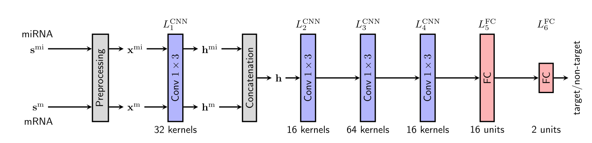

</head><body class="c7"><h1 class="c11" id="h.awd52smincp9">Deep learning model to identify target mRNA of microRNA sequences.</h1><h2 class="c5" id="h.mmdes9cpfgtm">Domain background</h2>
From a review of currently developed Deep learning models in genomics<a href="#ftnt1" id="ftnt_ref1">[1]</a>, I realized there is still a long way to go before the full stock of machine learning techniques will be applied to genomics at its maximum potential. In particular, I got fascinated by the deepTarget model that has recently been proposed as a way to identify microRNA targets with 96% accuracy - therefore I decided to focus my project in this field. 

MicroRNAs (miRNAs), which are small non-coding RNA molecules that consist of about 22 nucleotides, are known to regulate more than 60% of protein coding genes of humans and other mammals at the RNA level. As miRNAs control the function of their target messenger RNAs (mRNAs) by regulating the expression of the targets, investigating miRNAs is important to understand various biological processes, including diseases. To predict targets of given miRNAs, numerous computational tools have been proposed<a href="#ftnt2" id="ftnt_ref2">[2]</a>. 
<h2 class="c5" id="h.xngzpdmbdq9c">Problem Statement</h2>
Two types of computational problems about miRNAs thus naturally arise in bioinformatics: miRNA host identification (i.e., the problem of locating the genes that encode pre-miRNAs) and miRNA target prediction (i.e., the task of finding the mRNA targets of given miRNAs). This project focuses on the target prediction problem, aiming at deploying a model that is able to recognize whether or not a sequence of microRNA belongs to a given target mRNA. The output will be a binary classification of miRNA-mRNA pairs that match/ don&rsquo;t match (i.e. mRNA is a target of the given miRNA).
<h2 class="c5" id="h.gacl9v6aqsvf">Dataset</h2>
I will utilize experimental negative data collected from a 2020 paper &lsquo;Deep Learning-Based microRNA Target Prediction Using Experimental Negative Data&rsquo;<a href="#ftnt3" id="ftnt_ref3">[3]</a>&nbsp;that used the same dataset to train a deepTarget model.

The dataset is available here: https://github.com/ailab-seoultech/deepTarget 
<h2 class="c5" id="h.alsi2z4kx2z9">Solutions</h2>
I propose an end-to-end machine learning framework for functional miRNA target prediction following the deepTarget paper<a href="#ftnt2" id="ftnt_ref2">[2]</a>. I will use the dataset from Byunghan (2016) to test the deepTarget following the paper from 2020<a href="#ftnt3" id="ftnt_ref3">[3]</a>&nbsp;. This becomes the benchmark model for my project performance.

The proposed approach exploits one-dimensional convolutional neural networks (CNNs) based on sequence-to-sequence interaction learning framework and utilizes experimental negative data instead of mock one<a href="#ftnt2" id="ftnt_ref2">[2]</a>.
<h2 class="c5" id="h.gcb9cgk1a5zx">Evaluation metrics &nbsp;</h2>
The performance of the model against the benchmark will be evaluated using binary classification performance metrics including accuracy [(TP + TN)/(TP + TN + FP + FN), where TP, FP, FN, and TN represent the numbers of true positives, false positives, false negatives, and true negatives, respectively], sensitivity [TP/(TP + FN)] and specificity [TN/(TN + FP)].
<h2 class="c5" id="h.f3ou8vs432ik">Project Design</h2>
The proposed approach exploits one-dimensional convolutional neural networks (CNNs) based on sequence-to-sequence interaction learning framework.

Below an overview of the methodology proposed by the paper that I will emulate and test with different Conv layers configurations. 

<a href="#ftnt_ref1" id="ftnt1">[1]</a>&nbsp;Lefteris Koumakis, 2020. Deep learning models in genomics; are we there yet?

<a href="#ftnt_ref2" id="ftnt2">[2]</a>&nbsp;Lee Byunghan et al, 2016. deepTarget: End-to-end Learning Framework for microRNA Target Prediction using Deep Recurrent Neural Networks

<a href="#ftnt_ref3" id="ftnt3">[3]</a>&nbsp;Lee Byunghan, 2020. Deep Learning-Based microRNA Target Prediction Using Experimental Negative Data

</body></html>
